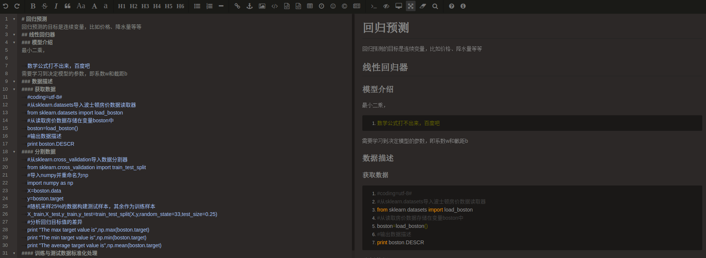
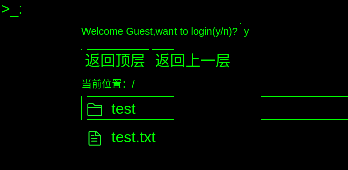

# 笔记管理系统

本项目是一个基于springboot的前后端分离的笔记管理系统，这里的笔记主要指的是markdown格式的笔记，目前已经有不少笔记web工具了，比如印象笔记、有道云笔记等，我也都用过，但是不能满足我的需求，一方面我主要的工作环境是Linux，这两种笔记都没有对应的客户端，另一方面，这两种笔记很难导出文本文件用于本地的编辑和存储，因此这里我实现了一个主要在Linux和web环境下的笔记管理系统，主要有以下特性：

* 可以在web端以HTML展示存储在文件目录下的markdown文件
* 可以在web端增加、删除文件夹和文件
* 可以在web端对文件目录下的markdown文件进行修改
* 可以轻松的将Linux桌面端和服务器上的笔记目录进行同步
* 具有笔记备份功能，防止误删等情况出现
* 具有简单的鉴权功能

## 1.项目结构

* note-management: springboot实现的服务端
* front:前端文件存放目录
* example-note:样例笔记根目录
* conf:nginx、cron等的配置文件

接下来会对这几个目录逐个进行说明。

## 2.后端实现

后端采用经典三层架构，action层处理请求，service层处理业务，dao层处理数据，其中dao层实现了文件、文件夹的增删查改。按目前的设计，我们会将整个笔记目录看作一棵树，叶子结点为笔记文本文件，非叶节点为文件夹。

在鉴权方面，目前没有使用数据库来存储用户名密码等，而是将密码写死在代码中，由于目前是私有用途，所以不打算去完善这里，登录业务在service/impl/UserServiceImpl中。鉴权的功能使用[sa-token](https://gitee.com/dromara/sa-token)实现。只有登录的人才能够完成文件夹、文件的创建、删除，以及其内容的修改，否则只能查看。

## 3.前端实现

前端实现了一个很丑的管理界面，风格是终端风格，黑底绿字，修改的话，在css/zekdot.css中进行修改。其中笔记显示时引入了marked.js和highlight.js，用于将markdown代码转换为html代码并且对markdown中的代码部分进行高亮显示。而在编辑的时候则引入了editor.md插件，这是一个很棒的markdown文本编辑器，甚至不会markdown语法的人也可以使用他完成笔记的编写。



## 4.服务启动

由于本系统采用前后端分离的设计，前端需要nginx作为服务器，所以首先需要在服务器端安装好nginx，然后增加一个配置文件note.conf，内容如下

```nginx
server {
        listen 8081; #default_server;


        server_name _;

        location / {
        		# 以下是前端文件夹所在的地址
                root 	/home/xxx/front;
                index index.html index.htm index.nginx-debian.html;
                try_files $uri $uri/ =404;
        }

        location /note/ {
                # 以下是笔记文件夹所在地址
                root /home/xxx/xxx/note;
        }

        location /api/ {
        		# 以下是后台服务端的地址
                proxy_pass http://localhost:8080/;
        }

    add_header 'Access-Control-Allow-Origin' '*';
    add_header 'Access-Control-Allow-Headers' 'X-Pagination-Current-Page,Content-Type';
    add_header 'Access-Control-Allow-Methods' 'PUT,GET,POST,HEAD,DELETE';
    add_header 'Access-Control-Expose-Headers' 'X-Pagination-Current-Page,Content-Type';
}
```

保存配置之后，启动后台服务器，再访问localhost:8081/list.html即可看到配置的笔记文件夹下的列表，如图所示为配置到/home/zekdot/xxx/note/test-example，启动后的情况：



到这里服务就启动完了。

## 5.笔记备份与同步

同步上，我使用的是rsync命令，包括pull和push两个操作，pull可以将服务器端对应文件夹的数据全部拉取到本地文件夹，push可以将本地文件夹的数据全部推送到远程服务端对应文件夹，这两个命令需要在笔记文件夹内使用。

push:

```sh
#用途:远程同步文件
rsync --delete-before -av ../note xxx@xxx.xxx.xxx.xx:/home/xxx/xxx/note
```

pull:

```sh
#用途:拉取远程文件
rsync --delete-before -av xxx@xxx.xxx.xxx.xx:/home/xxx/xxx/note ..
```

备份上，由于笔记基本上都是纯文本文件，最好的备份方式其实是git，为了避免同步时连同git的元文件一起同步，我将git目录初始化在了笔记根目录的上一层，在把上一层内的其他文件都用gitignore忽略掉，然后利用cron定时对当前的笔记进行commit。

git：

```sh
date=`date |sed 's| |_|g'`
cd /home/xxx/xxx
git add .
git commit -m "进行备份，当前时间为$date"
```

cron:

```sh
14 1 * * * /home/xxx/xxx/backNote.sh
```

这样在每天的1.14都会对笔记进行一次提交，如果需要找回以前的版本，只需要使用git log命令和git checkout命令就可以对笔记的版本进行回退和前进了。